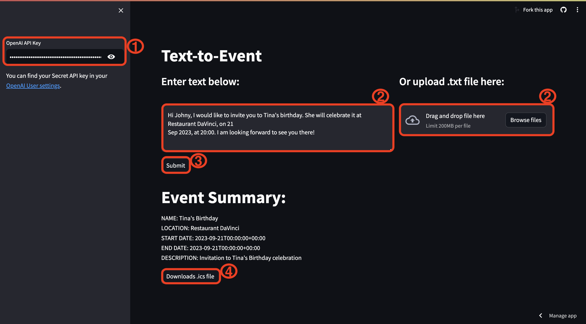

# text-to-event
### An application that reads text and outputs an event in .ics format, leveraging Streamlit, LangChain, and OpenAI API

App accessible at https://text-to-event.streamlit.app

### Instructions:
1) Enter your OpenAI API key in the box from the sidebar;
2) Select your timezone using the slider;
3) Enter the text you want to extract the details of your event from in the large box and press submit. Alternatively, you can upload a text file;
4) Download the .ics file to drop it in your Apple Calendar or [import it in your Google Calendar](https://support.google.com/calendar/thread/3231927/how-do-i-import-ics-files-into-google-calendar?hl=en).

